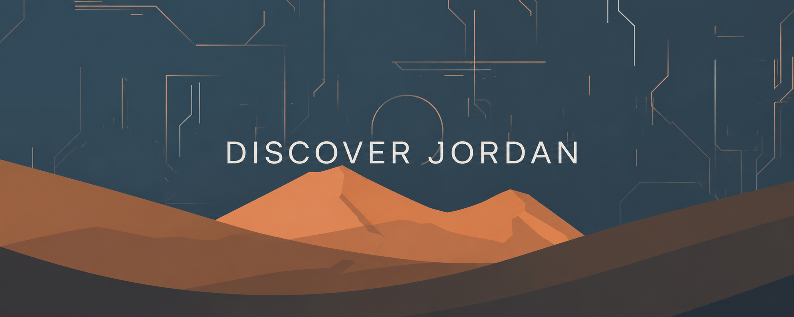

# 🇯🇴 Discover Jordan — Web Design Course Project

**Discover Jordan** is an interactive, modern tourism website developed to promote tourism in the Hashemite Kingdom of Jordan. It provides comprehensive information on religious, cultural, and therapeutic tourism destinations while highlighting the country's rich historical heritage, natural beauty, and hospitality.

---

## 🌐 Live Demo & Repository
* 🔗 **Live Website**: [Discover Jordan Live Demo](https://jordan-project.netlify.app/)
* 📁 **GitHub Repository**: [Discover Jordan Source Code](https://github.com/MohammedAbuNaim/Discover-Jordan)

---

## 👥 Project Team

| Student Name | Role |
| :--- | :--- |
| **Mohammad Tareq Mohammad Abu na'im** | **Team Leader & Core Developer** |
| **Asma Omar Ahmad Al-Fara'neh** | Team Member |
| **Nour Abdul Fattah Abdullah Alyan** | Team Member |

---

## 🎓 Academic Supervision
* **Course Instructor**: Dr. We'am Adel Mahmoud Telfah
* **Course**: Web Design Course
* **Institution**: Amman Arab University (AAU) — Faculty of Information Technology

---

## 🎯 Objectives of the Project
* Promote Jordan's tourism through a unified digital platform.
* Provide visitors with organized, reliable tourism information.
* Present historical, cultural, religious, and therapeutic attractions in an engaging format.
* Apply modern web development concepts and responsive design principles.
* Improve user experience through interactive navigation features.

---

## 🛠️ Technologies Used
* **HTML5**: Built the semantic structure and primary content of the website.
* **CSS3 & Tailwind CSS**: Styled a modern, responsive, and visually appealing user interface.
* **JavaScript (ES6+)**: Implemented dynamic functionality, DOM manipulation, and interactive features.
* **Font Awesome**: Integrated professional icons and visual UI enhancements.
* **Google Fonts**: Enhanced typography and customized Arabic language presentation.

---

## 📌 Main Website Sections
- 🏠 **Home Page**: Welcoming hero section & introduction.
- 🏛️ **About Jordan & History Timeline**: Historical context and milestones.
- 🕌 **Religious Tourism**: Detailed guide to holy sites.
- 🎨 **Cultural Tourism**: Highlighting Jordan's heritage and traditions.
- 🌊 **Therapeutic Tourism**: Dead Sea, Hot Springs, and wellness locations.
- 📞 **Contact Us Section**: Interactive form for feedback & inquiries.

---

## ⚡ JavaScript Functions & Logic
1. `showCategory(n)`: Dynamically displays the selected tourism category while hiding others (Religious, Cultural, Therapeutic).
2. `backToWhy()`: Returns the user to the "Why Jordan?" section and restores the main categories view.
3. **Smooth Scroll Navigation**: Handles smooth CSS/JS transitions between sections for optimal UX.
4. **Dynamic Show/Hide Operations**: Manages visibility for sections like the historical timeline using native DOM manipulation.

---

## ✨ Key Features
- 📱 Fully Responsive Design (Desktop, Tablet, Mobile).
- 🔄 Interactive Cards with smooth CSS hover effects.
- 🌐 Native Arabic RTL (Right-to-Left) interface support.
- 📍 Embedded Google Maps location routes.
- ⚡ Fast performance with clean dynamic UI operations.

---
*Academic Project prepared for the Web Design Course at Amman Arab University under the supervision of Dr. We'am Adel Mahmoud Telfah.*
